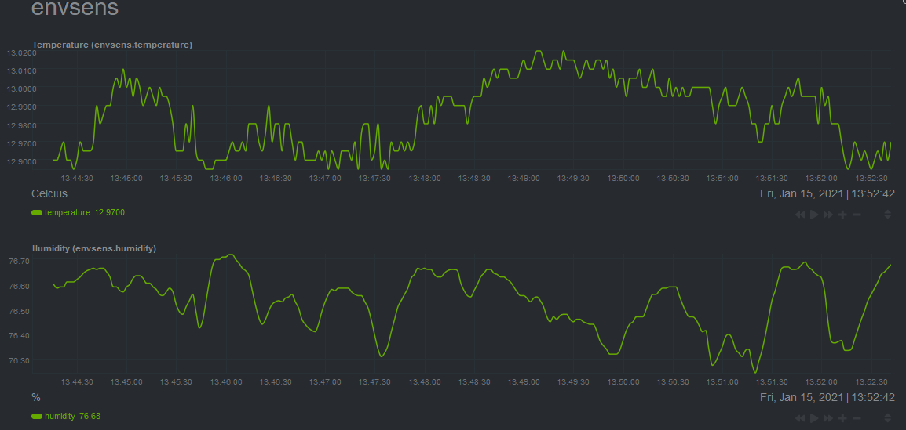

# Envsens

Recently I've found that I would like more information about the state of my basement. Specifically about the ambient temperature. Because the sensor on my now singular server did not seem to be accurate, I set out to add another sensor to my data collection and monitoring setup. The easiest way seemed to be to add a collector to Netdata. After trying to do this wirelessly, I settled on a serial connection.

The project is currently a little (very) rough around the edges, but it should work and may provide insight on how to add a python collector to Netdata.



## Installation

- sudo apt install python3-pip
- sudo pip3 install pyserial
- sudo apt install python-pip
- sudo pip install pyserial
- sudo cp envsens.chart.py /usr/libexec/netdata/python.d
- sudo adduser netdata dialout
- add `envsens: yes` to the last line of `/usr/lib/netdata/conf.d/python.d.conf`
- sudo systemctl restart Netdata

Now it should work. If it doesn't, debug with

```bash
sudo su -s /bin/bash netdata
/usr/libexec/netdata/plugins.d/python.d.plugin envsens debug trace nolock
```

## Development gotchas

Netdata is not strict about python versions. Make sure to have everything available for both python2 and python3. It's sad, but that's life.

For Netdata to talk to the sensor, you will likely have to add netdata to the dialout group. This has only been tested on Debian and Raspbian.

## To Do

- [ ] improve enumeration of devices (ttyS and ttyUSB and verification)
- [ ] add support for multiple devices
